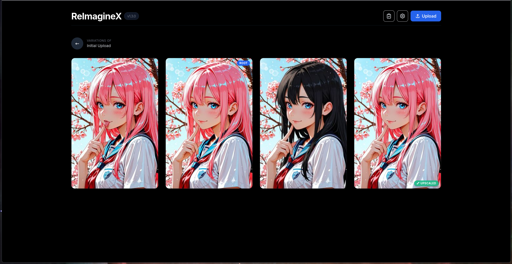
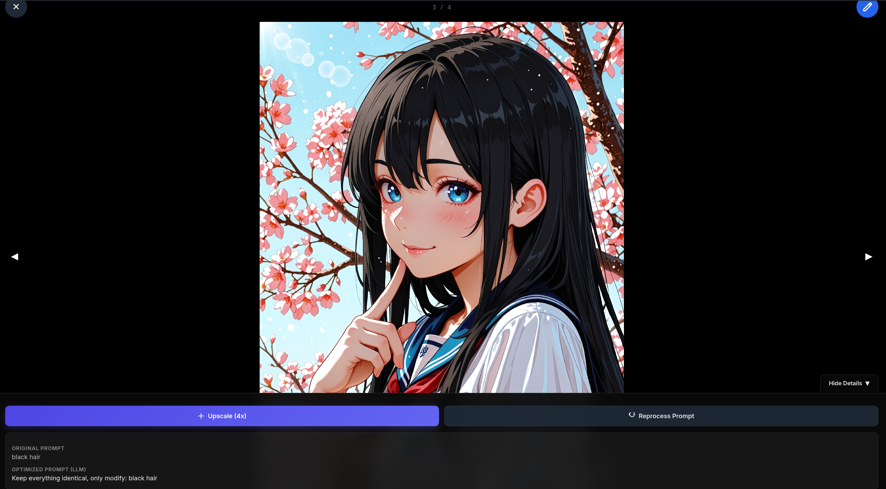
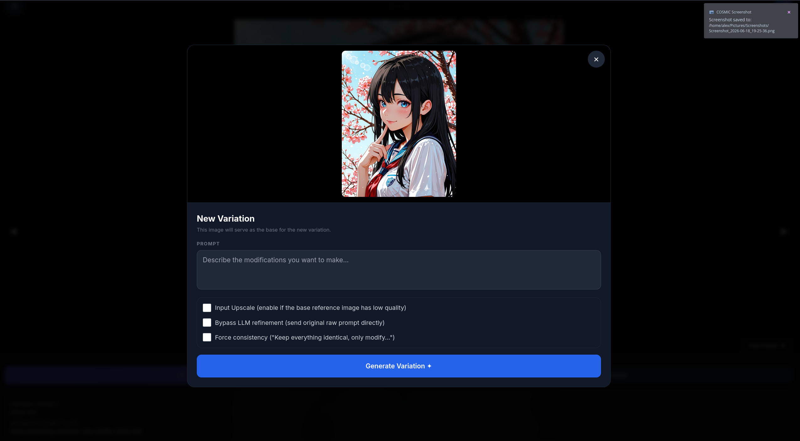

# ReImagineX ✦

ReImagineX is a fluid, high-performance web gallery and image-to-image variations interface. Heavily inspired by the clean aesthetics and user interactions of Grok's (xAI) "Imagine" tool, it provides a seamless workflow to generate, iterate, upscale, and organize image lineages locally using a **ComfyUI** backend and **OpenRouter** LLM prompt refinement.

---

## ✦ Previews

| Main Gallery | Prompt & Details | Variation Editor |
| :---: | :---: | :---: |
|  |  |  |

---

## ✦ Key Features

- **Linear & Lineage-based Navigation:** Organize generations by lineage. Click on a root image to explore all its child variations and iterations.
- **Natural Touch Gestures (Mobile optimized):**
  - **Swipe Up** anywhere on the image view to pull up the Prompt & Quick Actions drawer.
  - **Swipe Down** to close the image viewer and return to the gallery grid (or slide the drawer back down).
  - **Swipe Left/Right** on the image viewport to slide transition between completed images.
- **Premium Fluid Animations:**
  - **Staggered Card-Dealing Intro:** Cards fan out dynamically with 3D rotation, scaling, and slide-in cascading when loading the gallery.
  - **Zoom-Fade Opening:** Opening/closing full images scales the viewport smoothly.
  - **Swipe Transitions:** Swiping left/right slides the old image out and the new image in dynamically.
- **Direct Drawer Controls:**
  - **Upscale (4x):** Performs a high-resolution workflow pass using the parent's base image.
  - **Reprocess:** Resubmits the exact same configuration and prompt to generate a new variation.
- **Bulk Select & Delete:** Delete multiple images at once, cascading recursively to all their lineage descendants.
- **Auto-Cancellation on interrupt:** Deleting or canceling a pending generation sends a signal to ComfyUI to immediately cancel the job and clear the execution queue.
- **Dynamic Configuration:** Adjust API keys, ComfyUI URLs, diffusion checkpoints, VAE, CLIP, and prompt expansion prompts on the fly via the built-in Settings Panel.

---

## ✦ System Architecture & Setup

ReImagineX runs as a fast Python web server (FastAPI) acting as a orchestrator/proxy to your local ComfyUI instance.

### 1. Prerequisites

Before running the server, verify you have:
- **Python 3.12+**
- **uv** (high-performance Python package installer)
- A running **ComfyUI** instance.

### 2. Local Installation

Clone the repository and run dependencies setup using `uv`:

```bash
# Install dependencies and setup venv
uv sync
```

### 3. Environment Variables Configuration

Create a `.env` file in the root directory (you can copy `.env.example`):

```ini
# ComfyUI backend URL
COMFY_URL=http://127.0.0.1:8001

# Data directory for local images and state JSON
DATA_DIR=gallery_data

# OpenRouter API key (used for prompt expansion)
OPENROUTER_API_KEY=your_api_key_here
```

### 4. Running the Web App

You can quickly boot the server by running the startup script:

```bash
./start.sh
```

Alternatively, launch the local development web server manually:

```bash
uv run python src/server.py
```

The application will be accessible at: `http://localhost:8888`

---

## ✦ ComfyUI Backend Setup

> [!TIP]
> A pre-configured API workflow template is available in the project root as [workflow_api.json](workflow_api.json). You can load this file into your ComfyUI interface. If you are missing any custom nodes, use the **ComfyUI Manager** and click **Install Missing Custom Nodes** to install all required dependencies automatically.

For the generation workflows to validate successfully, your ComfyUI environment must meet the following configuration requirements:

### Required Models
Ensure the following models are downloaded and placed in the respective folders under your ComfyUI directory:

| Model File | Target Subfolder | Type | Description |
|---|---|---|---|
| `flux1-dev-fp8.safetensors` | `models/checkpoints/` | Diffusion (Flux2) | Main generation model |
| `clip_l.safetensors` | `models/clip/` | CLIP | Language understanding model |
| `ae.safetensors` | `models/vae/` | VAE | Image encoding and decoding |
| `4x_foolhardy_Remacri.pth` | `models/upscale_models/` | Upscale | Standard model used for upscaling |

### Required Custom Nodes
Install these custom nodes in your ComfyUI instance (via ComfyUI Manager or git clone inside `custom_nodes/`):

1. **rgthree-comfy** — provides `Seed (rgthree)` and `Image Comparer (rgthree)` nodes.
2. **DiffusionModelLoaderKJ** — Custom optimized loader for the Flux2 model.
3. **Flux2 custom nodes** — Custom nodes such as `Flux2Scheduler`, `ReferenceLatent`, `CFGGuider`, and `EmptyFlux2LatentImage`.

---

## ✦ User Guide & Workflow

1. **Upload a Base Image:** Click the **Upload** button in the header to import your starting image. This becomes the "Root" of a new lineage tree.
2. **Generate Variations:**
   - Click the root image in the gallery to enter its lineage view.
   - Click the **Create Variation** button (`btnOpenPrompt` pen icon) in the top-right corner of the modal.
   - Enter your prompt, toggle options (Bypass LLM, Force consistency, Input Upscale), and click **Generate**.
3. **Refining Lineage:** Swipe left or right through completed variations. Swipe up to access prompt details and perform quick upscaling or reprocessing tasks on the fly.
4. **Delete and Clean:** Toggle **Select Multiple** (`btnToggleSelection` checklist icon) in the header to purge unwanted lineage branches recursively.
